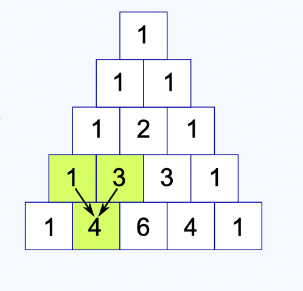

[Problem Link](https://leetcode.com/problems/pascals-triangle/description/)

### Problem Statement : 
Given an integer `numRows`, return the first numRows of **Pascal's triangle**.
<br/>
In **Pascal's triangle**, each number is the sum of the two numbers directly above it as shown:


---
### Variation 1 :
Given row number r and column number c. Print the element at position (r, c) in Pascal’s triangle.

```
nCr =    n!
	----------
	(n-r)! * r!
```

> Time Complexity : O(n) + O(n-r) + O(r)

---

### Variation 2 :
Given the row number n. Print the n-th row of Pascal’s triangle.


``` cpp
Let n = 6
           1
         1   1
       1   2   1
     1   3   3   1
   1   4   6   4   1
 1   5  10  10  5   1  <-- 6th row (0-indexed)


C(5, 1) = 5               = 5 / 1
C(5, 2) = 10              = (5×4)/(1×2)
C(5, 3) = 10              = (5×4×3)/(1×2×3)
C(5, 4) = 5               = (5×4×3×2)/(1×2×3×4)

int ans = 1;
for (int i = 1; i < n-1; i++) {
    ans = ans * (n - i);
    ans = ans / i;
    res[i] = ans;
}


```

> Time Complexity : O(n)

---
### Variation 3 : 

Given the number of rows n. Print the first n rows of Pascal’s triangle.

-> Extend the logic of variation 2, and calculate for n rows.

> Time Complexity : O(n^2)


### Code :
```cpp
vector<vector<int>> generate(int numRows) {
        vector<vector<int>> res;
        for(int i=1;i<=numRows;i++){
            if(i==1)
            res.push_back({1});
            else{
                vector<int> temp;
                temp.push_back(1);
                int ans = 1;
                for(int j=1;j<i-1;j++){
                    ans = ans * (i-j);
                    ans = ans/j;
                    temp.push_back(ans);
                }
                temp.push_back(1);
                res.push_back(temp);
            }
        }
        return res;
    }
```