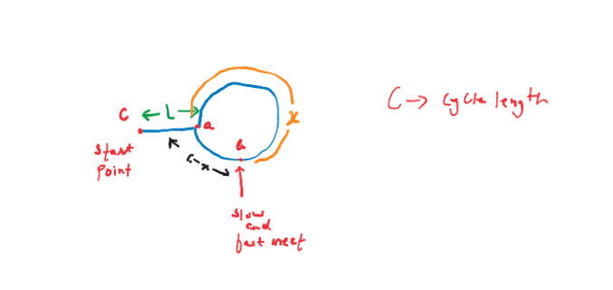

[Problem Link](https://leetcode.com/problems/find-the-duplicate-number/description/)

### Problem Statement : 
Given an array of integers `nums` containing `n + 1` integers where each integer is in the range `[1, n]` inclusive.
\
There is only **one repeated number** in `nums`, return _this repeated number_.
\
You must solve the problem **without** modifying the array `nums` and using only constant extra space.

## Examples

**Example 1:**

```
Input: nums = [1,3,4,2,2]
Output: 2
```

**Example 2:**

```
Input: intervals = [3,3,3,3]
Output: 3
```


### Approach 1 :

- Maintain a frequency array or hash-map and wherever count > 1, return that value.

> `Time Complexity` : O(n)
> 
> `Space Complexity` : O(n)

---
### Approach 2:
- Using array mutation
- Mark visited element's index as negative and whenever again we find an index marked as negative , then we have our repeated number.

> Time Complexity : O(n)
>
>Space Complexity : O(1)


---

### Approach 3:
- Heard and tortoise method (Floyd's Algo)
- The given array arrangement will always have a cycle since all the numbers correspond to an index and we have repeated elements



**Why slow and fast will meet?**
- Now since we have cycle we will start with two pointers `slow and fast`.
	- Slow will move with 1 step
	- Fast will move with 2 step
- Let gap between slow and fast be `x`.
- Once slow moves by 1 and fast moves by 2, gap between them reduces by 1.
- `gap = x-1 -> x-2 -> ....x-x = 0`
- `x` being an integer, gap will go to 0 and that is when slow and fast will meet.

**How to find point where cycle starts?**
- Let cycle length be `C`
- Let slow move by `d` and fast move by `2d`
- Extra distance covered by fast is proportional to cycles length
-```
```
2d - d = k * C
d = k * C -- (1)

Distance travelled by slow is d
d = L+x -- (2)

From (1) amd (2)

k * C = L+x
L = kC - x

L = C - x


```

- Hence if we keep one pointer at start and one at the meetup point and move until both are at same place we will get our starting point ie duplicate element.


```cpp
int findDuplicate(vector<int>& nums) {

	int n = nums.size();
	int slow = nums[0];
	int fast = nums[0];
	
	do{
		slow = nums[slow];
		fast = nums[nums[fast]];    
	}while(fast!=slow);

	slow = nums[0];

	while(fast!=slow){
		slow = nums[slow];
		fast = nums[fast];
	}
	return fast;
	
}
```


> Time Complexity : O(n)
>
>Space Complexity : O(1)
