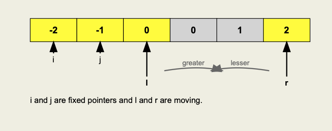

[Problem Link](https://leetcode.com/problems/4sum/description/)

Given an array `nums` of `n` integers, return _an array of all the **unique** quadruplets_ `[nums[a], nums[b], nums[c], nums[d]]` such that:

- `0 <= a, b, c, d < n`
- `a`, `b`, `c`, and `d` are **distinct**.
- `nums[a] + nums[b] + nums[c] + nums[d] == target`

You may return the answer in **any order**.

## Examples

**Example 1:**

```
Input: nums = [1,0,-1,0,-2,2], target = 0
Output: [[-2,-1,1,2],[-2,0,0,2],[-1,0,0,1]]
```

**Example 2:**

```
Input: nums = [2,2,2,2,2], target = 8
Output: [[2,2,2,2]]
```

### Approach 1 :

- Brute force
- Try out all quad and store all in a set whose sum is equal to target

> `Time Complexity` : O(n⁴)
> 
> `Space Complexity` : O(no of quad) * 2


---

### Approach 2:

- Run 3 loops `i,j,k`
- 4th value will be `target - (num[i]+num[j]+num[k])`
- Look for 4th in hash-map

> `Time Complexity` : O(n³) * log(m) where m = no of elements in set
> 
> `Space Complexity` : O(n+m) where m = unique quad


---

### Approach 3:

- Using two pointer
- Sort the array
- Fix two pointer `i` and `j`
- Let `l=j+1` and `r=n-1`



- To avoid duplicate skip elements if `a[i]==a[i+1]` and `a[j]==a[j+1]`
- if `a[i] + a[j] + a[l] + a[r] == target` then element is found
- do `l++` and `r--` and pass duplicates
- if `sum > target` then `r--` else `l++`

> `Time Complexity` : O(n³)
> 
> `Space Complexity` : O(1) 


**Code** :


```cpp

vector<vector<int>> fourSum(vector<int>& nums, int target) {
        
	int n = nums.size();
	sort(nums.begin(),nums.end()); //sorting to handle duplicates
	vector<vector<int>> res;

	for(int i = 0; i < n; i++){

		if(i>0 && nums[i]==nums[i-1])continue; //skip duplicate ith

		for(int j = i+1; j < n; j++){

			if(j>i+1 && nums[j]==nums[j-1]) continue; // skip duplicate jth
			//j>0 condtiton will not work since j starts from i+1 so we need to check from there
			int l = j+1, r = n-1;

			while(l<r){
				long long sum = nums[i]+nums[j];
				sum+=nums[l];
				sum+=nums[r];

				if(sum == target){
					res.push_back({nums[i],nums[j],nums[l],nums[r]});
					//skipping duplicates l and r
					while(l<r && nums[r]==nums[r-1])r--;
					while(l<r && nums[l]==nums[l+1])l++;

					l++;r--;
				   
				}else if(sum > target){
					r--;
				}else{
					l++;
				}
			}
		}
	   

	}
	return res;

}
```

---
