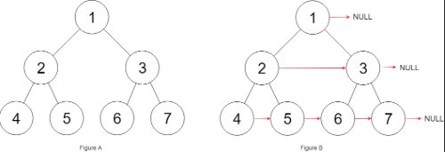

[Problem Link](https://leetcode.com/problems/populating-next-right-pointers-in-each-node/description/)
### Problem Statement : 

You are given a **perfect binary tree**:
- All leaves are on the same level.
- Every parent has exactly two children.
    
Each node has a `next` pointer that should be set to its immediate right neighbor.  
If no neighbor exists, set it to `NULL`.

**Example 1:**




```
Input: root = [1,2,3,4,5,6,7]
Output: [1,#,2,3,#,4,5,6,7,#]
Explanation: Given the above perfect binary tree (Figure A), your function should populate each next pointer to point to its next right node, just like in Figure B. The serialized output is in level order as connected by the next pointers, with '#' signifying the end of each level.         
```
`

---


###  Approach 1 :

- We use **Breadth-First Search (BFS)** to process the tree level by level:
1. **Use a queue** to store nodes of each level.
2. For every level:
    - Keep track of the **previous node** (`prev`).
    - Connect `prev->next = curr` as we iterate through nodes.
    - The last node in each level will have `next = NULL` (already initialized).
3. Push children (`left`, `right`) into the queue for the next level.

#### Code :

```cpp
Node* connect(Node* root) {
	queue<Node*> q;

	if (root) q.push(root);

	while (!q.empty()) {
		int sz = q.size();
		Node* prev = NULL; // track previous node in this level

		for (int i = 0; i < sz; i++) {
			Node* curr = q.front();
			q.pop();

			// link previous node to current
			if (prev) prev->next = curr;
			prev = curr;

			// push children for next level
			if (curr->left) q.push(curr->left);
			if (curr->right) q.push(curr->right);
		}
	}

	return root;
}

```


> `Time Complexity` : O(n)
> 
> `Space Complexity` : O(n) 

---

### Approach 2 :

- Start with the **leftmost node** of each level.
- Traverse that level using `next` pointers (already built).
- Connect the `left` and `right` children for the next level.

#### Code : 

``` cpp
Node* connect(Node* root) {
	
	Node* leftMost = root;

	while(leftMost && leftMost->left){
		Node* curr = leftMost;

		while(curr){
			curr->left->next = curr->right;

			if(curr->next)
			curr->right->next = curr->next->left;

			curr = curr->next;
		}

		leftMost = leftMost->left;

	}

	return root;

}
```

> `Time Complexity` : O(n)
> 
> `Space Complexity` : O(1)

---


