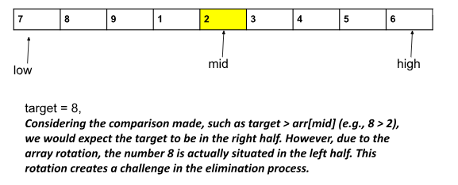

[Problem Link](https://leetcode.com/problems/single-element-in-a-sorted-array/description/)
### Problem Statement : 

Given an integer array `arr` of size N, sorted in ascending order (with distinct values) and a target value k. Now the array is rotated at some pivot point unknown to you. Find the index at which k is present and if k is not present return -1.
## Examples

**Example 1:**

```
Input: nums = [4,5,6,7,0,1,2], target = 0
Output: 4
```

### Approach 1 :

- Brute force
- We will traverse the array and check every element if it is equal to k. If we find any element, we will return its index.
- Otherwise, we will return -1.


> `Time Complexity` : O(n)
> 
> `Space Complexity` : O(1)

---

### Approach 2:

- Using binary search

 
- Though the array is rotated, we can clearly notice that for every index, one of the 2 halves will always be sorted. In the above example, the right half of the index mid is sorted.
- So, to efficiently search for a target value using this observation, we will follow a simple two-step process. 
- First, we identify the sorted half of the array. 
- Once found, we determine if the target is located within this sorted half. 
    - If not, we eliminate that half from further consideration. 
    - Conversely, if the target does exist in the sorted half, we eliminate the other half.

#### Code :

```cpp
int search(vector<int>& nums, int target) {
	
	int l = 0, r = nums.size()-1;

	while(l<=r){
		int mid = (r-l)/2 + l;
		if(nums[mid]==target){
			return mid;
		}
		if(nums[mid] >= nums[l]){
			// sorted on left
			if(target>=nums[l] && target<=nums[mid]){
				r = mid-1;
			}else{
				l = mid+1;
			}
		}else{
			// sorted on right
			if(target>=nums[mid] && target<=nums[r]){
				l = mid+1;
			}else{
				r = mid-1;
			}
		}

	}
	return -1;
}
```

> `Time Complexity` : O(log n)
> 	
> `Space Complexity` : O(1)

---
