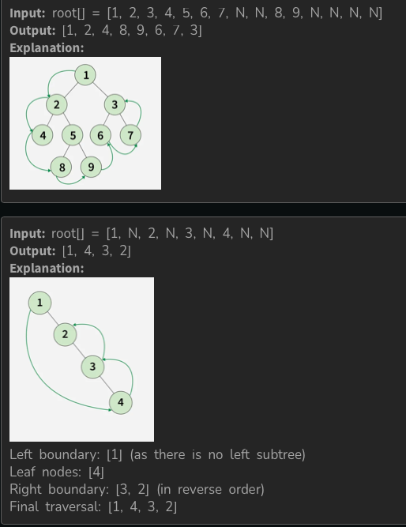

[Problem Link](https://www.geeksforgeeks.org/problems/boundary-traversal-of-binary-tree/1)
### Problem Statement : 

Given a Binary Tree, return its **Boundary Traversal** in the following order:
1. **Left Boundary**: Nodes from root to leftmost leaf (excluding leaves).
2. **Leaf Nodes**: All leaf nodes (left to right).
3. **Right Boundary (reversed)**: Nodes from rightmost leaf to root (excluding leaves and root if already included).
    
**Note**:
- If the root has no left or right subtree, root itself is treated as boundary.

**Example 1:**



`

---


###  Approach 1 :

- Add **root** to result.
- Traverse **left boundary** (excluding leaf nodes).
- Collect **leaf nodes** using DFS (both left & right subtrees).
- Traverse **right boundary** (excluding leaf nodes) using stack for reversal.
- Append everything in correct order.

#### Code :

```cpp
class Solution {
  public:
    // Collect leaf nodes
    void dfs(Node* root, vector<int> &res) {
        if (!root) return;
        if (!root->left && !root->right) {
            res.push_back(root->data);
            return;
        }
        dfs(root->left, res);
        dfs(root->right, res);
    }

    vector<int> boundaryTraversal(Node *root) {
        vector<int> res;
        if (!root) return res;

        // Add root
        res.push_back(root->data);

        // Left boundary (excluding leaf nodes)
        Node* curr = root->left;
        while (curr && (curr->left || curr->right)) {
            res.push_back(curr->data);
            if (curr->left) curr = curr->left;
            else curr = curr->right;
        }

        // Leaf nodes
        dfs(root->left, res);
        dfs(root->right, res);

        // Right boundary (use stack to reverse)
        stack<int> st;
        curr = root->right;
        while (curr && (curr->left || curr->right)) {
            st.push(curr->data);
            if (curr->right) curr = curr->right;
            else curr = curr->left;
        }
        while (!st.empty()) {
            res.push_back(st.top());
            st.pop();
        }

        return res;
    }
};

```


> `Time Complexity` : O(n)
> 
> `Space Complexity` : O(H) for recursion/stack, where H = Height of tree

---

