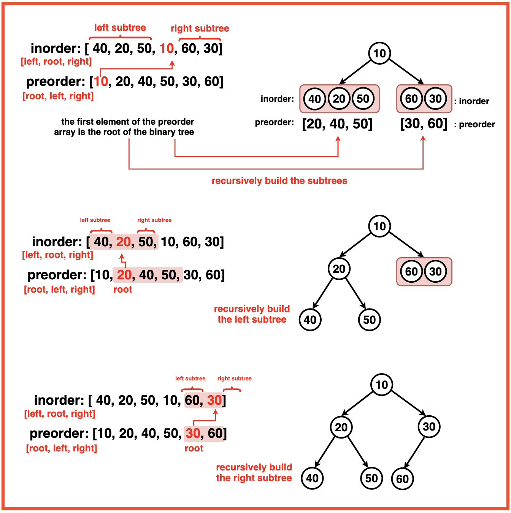

[Problem Link](https://leetcode.com/problems/construct-binary-tree-from-preorder-and-inorder-traversal/description/)
### Problem Statement : 

Given two integer arrays `preorder` and `inorder` where `preorder` is the preorder traversal of a binary tree and `inorder` is the inorder traversal of the same tree, construct and return _the binary tree_.

**Example 1:**

```
Input : 
preorder = [3, 9, 20, 15, 7]  
inorder  = [9, 3, 15, 20, 7]  

Output :
        3
       / \
      9   20
         /  \
        15   7


```
`

---

###  Approach 1 :

- **Preorder Traversal**:
    - The first element is always the **root**.
- **Inorder Traversal**:
    - Elements to the **left** of the root are in the **left subtree**.
    - Elements to the **right** of the root are in the **right subtree**.    
- **Approach**:
    - Use preorder to pick the root.
    - Find the root index in inorder (using a hashmap for O(1) lookups).
    - Recur for left and right subtrees by slicing appropriate ranges in preorder & inorder.



#### Code :

```cpp
class Solution {
public:
    unordered_map<int,int> mp;

    TreeNode* builder(int ileft, int iright, vector<int>& preorder,
                      int jleft, int jright, vector<int>& inorder) {
        if (ileft > iright || jleft > jright) return NULL;

        // Root is first element in preorder
        TreeNode* root = new TreeNode(preorder[ileft]);

        // Index of root in inorder
        int k = mp[preorder[ileft]];
        int leftSize = k - jleft;

        // Build left and right subtrees
        root->left = builder(ileft + 1, ileft + leftSize, preorder, jleft, k - 1, inorder);
        root->right = builder(ileft + leftSize + 1, iright, preorder, k + 1, jright, inorder);

        return root;
    }

    TreeNode* buildTree(vector<int>& preorder, vector<int>& inorder) {
        int n = preorder.size();
        for (int i = 0; i < n; i++) {
            mp[inorder[i]] = i; // store inorder indices
        }
        return builder(0, n - 1, preorder, 0, n - 1, inorder);
    }
};

```


> `Time Complexity` : O(n) 
> 
> `Space Complexity` : O(n) hashmap + recursion stack

---

