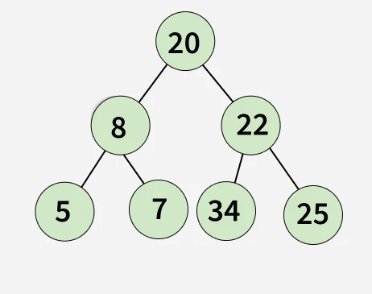

[Problem Link](https://www.geeksforgeeks.org/problems/bottom-view-of-binary-tree/1)
### Problem Statement : 

Given the root of a binary tree, return an array representing the **bottom view** of the binary tree from left to right.

- The **bottom view** means nodes visible when the tree is viewed from the bottom.

- If two nodes overlap in the same vertical line (same horizontal distance), the **later one in level order traversal**(lower/deeper one) is chosen.

**Example 1:**



`Horizontal Distances:
- hd(-2): 5
- hd(-1): 10
- hd(0): 3
- hd(1): 14
- hd(2): 25
Output - 5 8 34 22 25
`

---


###  Approach 1 :

- **Horizontal Distance (HD):**
    - Root has `hd = 0`.    
    - Left child → `hd - 1`.
    - Right child → `hd + 1`.
- **Level Order Traversal (BFS):**
    - Ensures we always process nodes level by level.
    - If multiple nodes share the same `hd`, the **latest one encountered in BFS** replaces the earlier one.
- **Data Structures Used:**
    - `map<int,int>` → stores `{hd → node->data}` (ordered by hd for left-to-right output).
    - `queue<pair<Node*,int>>` → for BFS traversal storing `{node, hd}`.

#### Code :

```cpp
vector<int> bottomView(Node *root) {
	// Your Code Here
	
	queue<pair<Node*,int>> q;
	q.push({root,0});
	map<int,Node*> mp;
	vector<int> res;
	
	while(!q.empty()){
		Node* curr = q.front().first;
		int d = q.front().second;
		q.pop();
		mp[d] = curr;
		
		if(curr->left){
			q.push({curr->left,d-1});
		}
		if(curr->right){
			q.push({curr->right,d+1});
		}
	}
	
	for(auto i:mp){
		res.push_back(i.second->data);
	}
	return res;
}
```


> `Time Complexity` : `O(n log n)`  -> Each N node is processed once and insertion in ordered map is log N.
> 
> `Space Complexity` : O(n)-> map + queue

---
