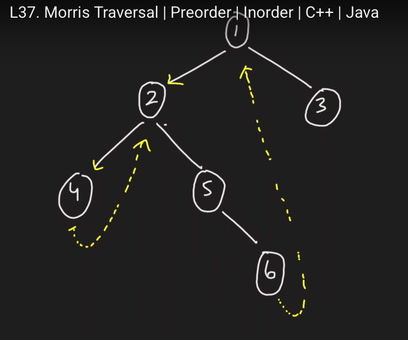

[Problem Link](https://leetcode.com/problems/binary-tree-inorder-traversal/)
### Problem Statement : 

Given the `root` of a binary tree, return _the inorder traversal of its nodes' values_.

**Example 1:**

```
Input :
    1
     \
      2
     /
    3
Output : 1 3 2


```

---

###  Approach 1 :

- Recursive approach
- Base idea: Recursively traverse left subtree, process current node, then traverse right subtree.

#### Code :

```cpp
void go(TreeNode* root,vector<int> &res){
	if(root==NULL)
	return;

	go(root->left,res);
	res.push_back(root->val);
	go(root->right,res);
}

vector<int> inorderTraversal(TreeNode* root) {
	
	vector<int> res;
	go(root,res);
	return res;
	
}
```


> `Time Complexity` : `O(n)`
> 
> `Space Complexity` : O(h)-> (due to recursion stack, where `h` = height of tree). Worst case `O(n)` for skewed tree, `O(log n)` for balanced tree.

---

### Approach 2 :

- Use a stack to simulate recursion.
- Keep going left, push nodes to stack. When no more left, pop, process, then go right.

#### Code :

```cpp
vector<int> inorderTraversal(TreeNode* root) {
	
	vector<int> res;
	stack<TreeNode*> st;

	while(root || !st.empty()){

		while(root){
			st.push(root);
			root = root->left;
		}
		TreeNode* curr = st.top();
		st.pop();
		res.push_back(curr->val);
		root = curr->right;
	}

	return res;
	
}
```


> `Time Complexity` : `O(n)`
> 
> `Space Complexity` : O(h)-> (due to stack, where `h` = height of tree). Worst case `O(n)` for skewed tree, `O(log n)` for balanced tree.


---

### Approach 3 :

- Modify the tree temporarily to avoid stack/recursion.
- Create links to predecessor nodes to traverse without extra memory.

#### Example :

```
          1
        /   \
       2     3
      / \
     4   5
          \
           6

output : 4 2 5 6 1 3
```

 
#### Code :

```cpp
vector<int> inorderTraversal(TreeNode* root) {
	
	vector<int> res;
	TreeNode* curr = root;

	while(curr){

		if(curr->left == NULL){
			res.push_back(curr->val);
			curr = curr->right;
		}else{

			TreeNode* leftPart = curr->left;
			while(leftPart->right && leftPart->right!=curr){
				leftPart = leftPart->right;
			}

			if(leftPart->right == curr){

				leftPart->right = NULL;
				res.push_back(curr->val);
				curr = curr->right;

			}else{
				leftPart->right = curr;
				curr = curr->left;
			}

		}

	}

	return res;
}
```


> `Time Complexity` : `O(n)`
> 
> `Space Complexity` : O(1)


---


