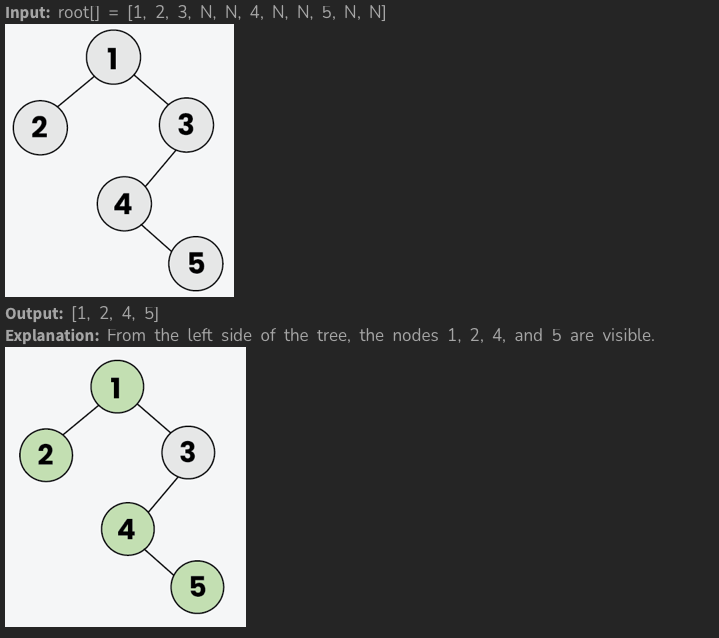

[Problem Link](https://www.geeksforgeeks.org/problems/left-view-of-binary-tree/1)
### Problem Statement : 

Given the **root** of a binary tree. Your task is to return the **left view** of the binary tree. The **left view** of a binary tree is the set of nodes visible when the tree is **viewed** from the **left side**.

If the tree is empty, return an **empty list**.

**Example 1:**



---


###  Approach 1 :

- **We use a stack to simulate recursive DFS (Preorder Traversal)**:
    - Preorder = `Root → Left → Right`.
- **Tracking Levels**:
    - Each node is pushed with its `level` value.
    - The first time we reach a new `level`, that node is part of the left view.
- **Why push `right` before `left`?**
    - Since stack is **LIFO**, we want the `left` child to be processed **before** the `right`.
    - If we pushed `left` first, it would get popped **after** the right, which would break left-view logic.
- **Key check**:
    `if(level == res.size())     res.push_back(curr->data);`
    - At level 0 → `res.size() == 0`, add root.
    - At level 1 → `res.size() == 1`, add first child at level 1.
    - This ensures only the **first node at each level** (the leftmost) is added.

#### Code :

```cpp
vector<int> leftView(Node *root) {
    vector<int> res;
    stack<pair<Node*,int>> st;   // stack holds {node, level}
    
    if(root)
        st.push({root,0});      // start with root at level 0
    
    while(!st.empty()){
        Node* curr = st.top().first;
        int level = st.top().second;
        st.pop();
        
        // If this is the first node we are visiting at this level
        if(level == res.size())
            res.push_back(curr->data);
        
        // Push right first, so left is processed first (stack is LIFO)
        if(curr->right)
            st.push({curr->right, level+1});
        if(curr->left)
            st.push({curr->left, level+1});
    }
    return res;
}
```


> `Time Complexity` : `O(n)`
> 
> `Space Complexity` : O(h)-> (due to stack, where `h` = height of tree). Worst case `O(n)` for skewed tree, `O(log n)` for balanced tree.

---
