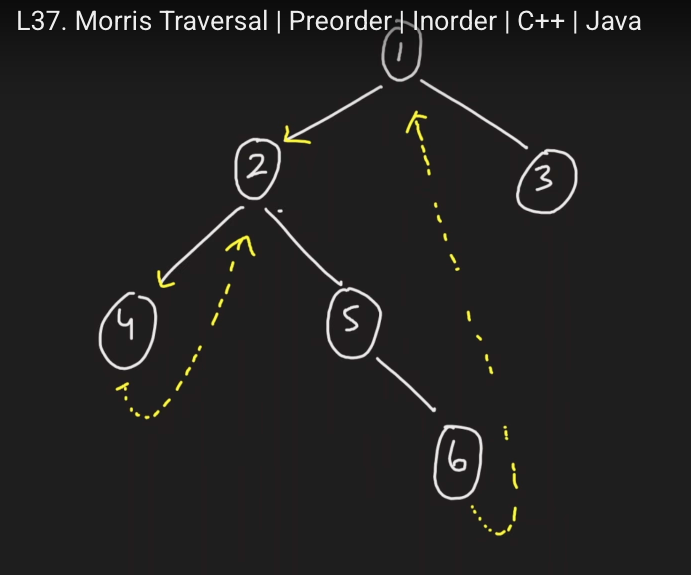

[Problem Link](https://leetcode.com/problems/binary-tree-preorder-traversal/description/)
### Problem Statement : 

Given the `root` of a binary tree, return _the preorder traversal of its nodes' values_.

**Example 1:**

```
Input :
    1
     \
      2
     /
    3
Output : 1 2 3


```

---

###  Approach 1 :

- Recursive approach
- Visit root → recurse left → recurse right.

#### Code :

```cpp
void go(TreeNode* root,vector<int> &res){
	if(root==NULL)
	return;

	res.push_back(root->val);
	go(root->left,res);
	go(root->right,res);
}

vector<int> preorderTraversal(TreeNode* root) {
	
	vector<int> res;
	go(root,res);
	return res;
}
```


> `Time Complexity` : `O(n)`
> 
> `Space Complexity` : O(h)-> (due to recursion stack, where `h` = height of tree). Worst case `O(n)` for skewed tree, `O(log n)` for balanced tree.

---

### Approach 2 :

- Use a stack to simulate recursion.
- Push root, pop, process it, then push right before left.

#### Code :

```cpp
vector<int> preorderTraversal(TreeNode* root) {
	
	vector<int> res;
	stack<TreeNode*> st;
	if(root)
	st.push(root);

	while(!st.empty()){

		TreeNode* curr = st.top();
		st.pop();

		res.push_back(curr->val);


		if(curr->right)
		st.push(curr->right);
		if(curr->left)
		st.push(curr->left);
	}

	return res;

}
```


> `Time Complexity` : `O(n)`
> 
> `Space Complexity` : O(h)-> (due to stack, where `h` = height of tree). Worst case `O(n)` for skewed tree, `O(log n)` for balanced tree.


---

### Approach 3 :

- Modify tree temporarily to avoid recursion/stack.
- If node has left, find predecessor:
    - If no thread → record value, make predecessor’s right = node, move left.
    - If thread exists → remove thread, move right.

#### Example :

```
          1
        /   \
       2     3
      / \
     4   5
          \
           6

output : 1 2 4 5 6 3
```

 
#### Code :

```cpp
vector<int> preorderTraversal(TreeNode* root) {
	
	TreeNode* curr = root;
	vector<int> res;
	while(curr){


		if(curr->left==NULL){
			res.push_back(curr->val);
			curr = curr->right;
		}else{
			TreeNode* leftPart = curr->left;

			while(leftPart->right && leftPart->right!=curr){
				leftPart = leftPart->right;
			}

			if(leftPart->right == curr){
				leftPart->right = NULL;
				curr = curr->right;
			}else{
				leftPart->right = curr;
				res.push_back(curr->val);
				curr = curr->left;
				
			}
		}
	}
	return res;
}
```


> `Time Complexity` : `O(n)`
> 
> `Space Complexity` : O(1)


---


