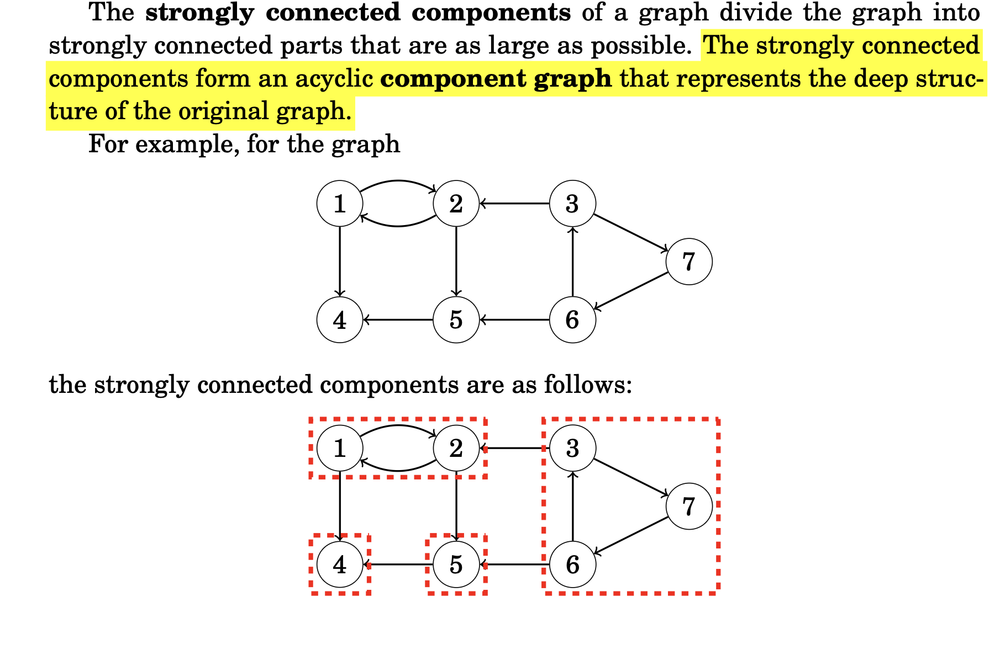

[Problem Link](https://www.geeksforgeeks.org/problems/strongly-connected-components-kosarajus-algo/1)
### Problem Statement : 

Given an adjacency list, **adj** of Directed Graph, Find the number of strongly connected components in the graph.

```
A graph is strongly connected if there is a path from any node to all other
nodes in the graph.
```




---

### Approach 1 :

- Kosaraju’s algorithm finds SCCs in **O(V + E)** time.

1. **Do a DFS traversal** of the original graph, storing vertices in a stack by their **finishing times** (post-order).
    
2. **Transpose the graph** (reverse all edges).
    
3. **Process vertices in stack order** (from top → bottom), performing DFS on the transposed graph.
    - Each DFS call gives one **SCC**.
        
### Intuition

- Finishing times help ensure we start from the **“deepest” node** of a component.
- Reversing edges allows us to gather all nodes **that can reach each other**.
- Since all edges are reversed, the component does not ”leak” to other
parts in the graph.
- DFS on transposed graph groups nodes into SCCs.

### Applications

- Detecting **deadlocks** in operating systems.
- Program analysis (detecting strongly connected procedures).
- Web crawling (finding clusters of interconnected websites).
- Network connectivity.


#### Code :

``` cpp
class Solution {
  public:
  
    void dfs(int u, vector<vector<int>> &adj,vector<int> &vis,stack<int> &st,bool flag){
        
        vis[u] = 1;
        
        for(auto& v:adj[u]){
            
            if(vis[v]==0){
                dfs(v,adj,vis,st,flag);
            }
        }
        if(flag)
        st.push(u);
        
    }
  
    int kosaraju(vector<vector<int>> &adj) {

        int n = adj.size();
        vector<vector<int>> transpose(n);
        
        for(int u=0;u<n;u++){
            for(auto& v : adj[u]){
                transpose[v].push_back(u);
            }
        }
        
        stack<int> st;
        vector<int> vis(n);
        
        for(int i=0;i<n;i++){
            if(vis[i]==0){
                dfs(i,adj,vis,st,1);
            }
        }
        
        vis.assign(n,0);
        int components = 0;
        while(!st.empty()){
            int u = st.top();
            st.pop();
            if(vis[u]==0){
                components++;
                dfs(u,transpose,vis,st,0);
            }
        }
        return components;
        
    }
};
```


> `Time Complexity` : O(V + E) (Each cell processed once)
> 
> `Space Complexity` : O(V+E) (stack + transpose graph) 

---

