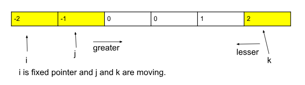

[Problem Link](https://leetcode.com/problems/3sum/description/)

Given an integer array nums, return all the triplets `[nums[i], nums[j], nums[k]]` such that `i != j`, `i != k`, and `j != k`, and `nums[i] + nums[j] + nums[k] == 0`.

Notice that the solution set must not contain duplicate triplets.

## Examples

**Example 1:**

```
Input: nums = [-1,0,1,2,-1,-4] 
Output: [[-1,-1,2],[-1,0,1]]
```


### Approach 1 :

- Brute force
- Try out all triplet and store all in a set whose sum is equal to 0

> `Time Complexity` : O(N³ * log(no. of unique triplets))
> 
> `Space Complexity` : O(2 * no. of the unique triplets) as we are using a set data structure and a list to store the triplets.


---

### Approach 2:

- Run 2 loops `i,j`
- 3rd value will be `0 - (num[i]+num[j])`
- Look for 3rd value in hash-map

> `Time Complexity` : O(n2) * log(m) where m = no of elements in set
> 
> `Space Complexity` : O(n+m) where m = unique triplet


---

### Approach 3:

- Using two pointer
- Sort the array
- Fix pointer `i` 
- Let `l=i+1` and `r=n-1`



- To avoid duplicate skip elements if `a[i]==a[i+1]``
- if `a[i] + a[l] + a[r] == target` then element is found
- do `l++` and `r--` and pass duplicates
- if `sum > target` then `r--` else `l++`


**Code** :


```cpp
vector<vector<int>> threeSum(vector<int>& nums) {
	int n = nums.size();
	vector<vector<int>> res;
	sort(nums.begin(),nums.end());

	for(int i=0; i<n; i++){

		if(i>0 && nums[i]==nums[i-1])
		continue;


		int l = i+1;
		int r = n-1;

		while(l<r){
			int sum = nums[i] + nums[l] + nums[r];
			if(sum>0){
				r--;
			}else if(sum<0){
				l++;
			}else{
				res.push_back({nums[i],nums[l],nums[r]});
				l++;
				r--;

				while(l<n && nums[l]==nums[l-1])
				l++;
				while(r>i && nums[r]==nums[r+1])
				r--;

			}
		}

	   
	}
	return res;

    }
```


> `Time Complexity` : O(n2)
> 
> `Space Complexity` : O(1), ignoring the result space 
---
