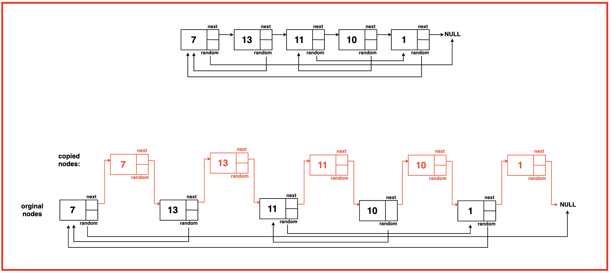

[Problem Link](https://leetcode.com/problems/copy-list-with-random-pointer/description/)
### Problem Statement : 

Given a linked list where every node in the linked list contains two pointers:

1. ‘next’ which points to the next node in the list.
2. ‘random’ which points to a random node in the list or ‘null’.

Create a ‘deep copy’ of the given linked list and return it.


### Approach 1 :

- Using Hash-map
- First pass: Create all new nodes and store mapping in HashMap
- Second pass: Set next and random pointers using the mapping

#### Code :

``` cpp
Node* copyRandomList(Node* head) {
        
	Node* temp = head;
	
	unordered_map<Node*,Node*> mp;
	while(temp){
		mp[temp] = new Node(temp->val);
		temp = temp->next;
	}
	
	Node* head1 = mp[head];
	temp = head1;
	while(head){
		temp->next = mp[head->next];
		temp->random = mp[head->random];
		temp = temp->next;
		head = head->next;
	}
	return head1;
}
```


> `Time Complexity` : O(n)
> 
> `Space Complexity` : O(n)
---

### Approach 2 :
- Interweaving (Space Optimized)
- Create copies and interweave them with original nodes
- Set random pointers using the interweaved structure
- Separate the original and copied lists




#### Code : 

```cpp
 Node* copyRandomList(Node* head) {
        
        if(head==NULL)
        return head;
        // Step 1: Create copies and interweave
        Node* temp = head;
        while(temp){
            Node* next = temp->next;
            Node* copy = new Node(temp->val);
            temp->next = copy;
            copy->next = next;
            temp = next;
        }

        
        // Step 2: Set random pointers
        temp = head;
        while(temp){
            if(temp->random)
            temp->next->random = temp->random->next;

            temp = temp->next->next;
        }

       // Step 3: Seperate the lists
       Node* original = head;
       Node* copyHead = head->next;
       Node* copy = copyHead;

       while(original){
        original->next = copy->next;
        if(copy->next){
            copy->next = copy->next->next;
        }
        original = original->next;
        copy = copy->next;
       }

       return copyHead;
    }

```

> `Time Complexity` : O(n)
> 
> `Space Complexity` : O(1) (not considering the result space)

---
