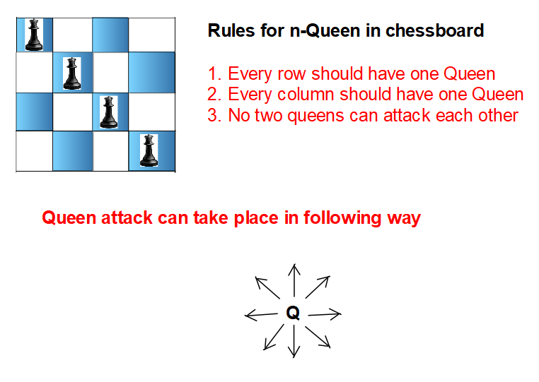
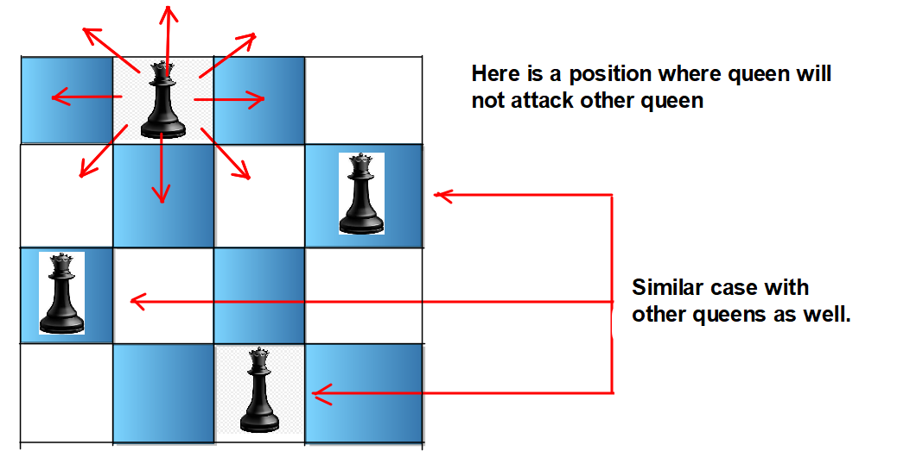
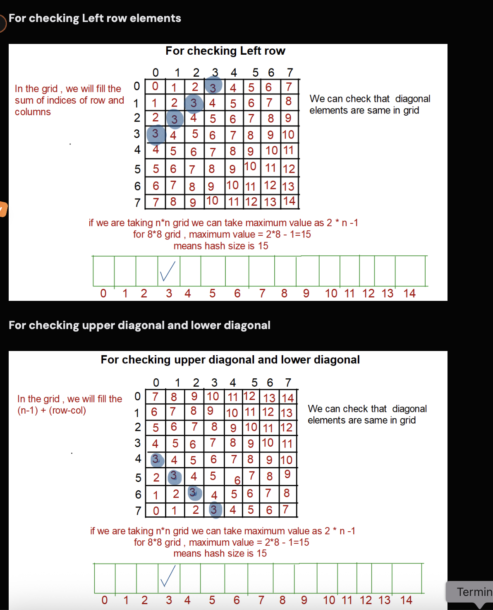

[Problem Link](https://leetcode.com/problems/n-queens/description/)
### Problem Statement : 


The **n-queens** puzzle is the problem of placing `n` queens on an `n x n` chessboard such that no two queens attack each other.

Given an integer `n`, return _all distinct solutions to the **n-queens puzzle**_. You may return the answer in **any order**.

Each solution contains a distinct board configuration of the n-queens' placement, where `'Q'` and `'.'` both indicate a queen and an empty space, respectively.




### Approach 1 :

- Using the concept of Backtracking
- We place Queen at different positions of the chessboard and find the right arrangement where all the n queens can be placed on the `nxn` grid.
#### Code :

``` cpp
bool canPlace(int x,int y,vector<string> &board,int n){

	// check column above 
	for(int i=0;i<x;i++){
		if(board[i][y]=='Q')
		return false;
	}

	// check top left diagonal
	for(int i=x-1,j=y-1; i>=0 && j>=0;i--,j--){
		if(board[i][j]=='Q')
		return false;
	}

	// check top right diagonal
	for(int i=x-1,j=y+1;i>=0 && j<n;i--,j++){
		if(board[i][j]=='Q')
		return false;
	}

	return true;

}

void recur(int i,int n,vector<string> &board,vector<vector<string>> &res){

	if(i==n){
		res.push_back(board);
		return;
	}

	for(int j=0;j<n;j++){
		if(canPlace(i,j,board,n)){
			board[i][j] = 'Q';
			recur(i+1,n,board,res);
		}
		board[i][j] = '.';
	}
}


vector<vector<string>> solveNQueens(int n) {
	
	vector<vector<string>> res;

	string row = "";
	for(int i=0;i<n;i++){
		row+='.';
	}

	vector<string> board;

	for(int i=0;i<n;i++){
		board.push_back(row);
	}

	recur(0,n,board,res);

	return res;
}
```


> `Time Complexity` : O(n × n!) -> n! is number of recursive calls and n is safety check
> 
> `Space Complexity` : `O(1)` (not considering stacks and result space)

---

### Approach 2 :

- This is the optimization of the `canPlace` function. '
- In the previous `canPlace` function, we needed the time O(N) for the column, and O(N) for the diagonal check. 
- Here, we will use hashing to maintain a list to check whether that position can be the right one or not.



#### Code :

``` cpp

void recur(int i,int n,vector<string> &board,vector<vector<string>> &res,vector<int> &col,vector<int> &leftTopDiag,vector<int> &rightTopDiag){

	if(i==n){
		res.push_back(board);
		return;
	}

	for(int j=0;j<n;j++){
		if(!col[j] && !leftTopDiag[i+j] && !rightTopDiag[n-1 + i-j]){
			board[i][j] = 'Q';
			col[j] = 1;
			leftTopDiag[i+j] = 1;
			rightTopDiag[n-1 + i-j] = 1; 

			recur(i+1,n,board,res,col,leftTopDiag,rightTopDiag);

			board[i][j] = '.';
			col[j] = 0;
			leftTopDiag[i+j] = 0;
			rightTopDiag[n-1 + i-j] = 0; 
		}
	  
	}
}

vector<vector<string>> solveNQueens(int n) {
	
	vector<vector<string>> res;
	string row = string(n,'.');

	vector<string> board;

	for(int i=0;i<n;i++){
		board.push_back(row);
	}

	vector<int> col(n);
	vector<int> leftTopDiag(2*n-1);
	vector<int> rightTopDiag(2*n-1);

	recur(0,n,board,res,col,leftTopDiag,rightTopDiag);

	return res;
}


```


> `Time Complexity` : O(n) -> n! is number of recursive calls
> 
> `Space Complexity` : `O(n)` (for hash arrays and not considering stacks and result space)

---
